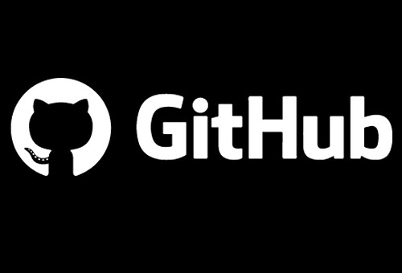

# GitHub.com

*Git - Global Information Tracker* — это распределенная система управления версиями. И в этом определении, вся суть Git’а.

*Что такое Git?*
Git – это разновидность VCS (Version Control System). А VCS – это программа для работы с постоянно изменяющейся информацией. Такое ПО может хранить множество версий одного и того же файла (документа) и возвращаться к более раннему состоянию (версии).

Например, код пишут четыре программиста. Они работают в разных местах, с разных компьютеров, в разное время. VCS сохраняет все изменения, внесенные всеми программистами, и в любой момент можно вернуться к версии, созданной три дня или месяц назад.

Git относится к распределенным системам, поэтому не зависит от центрального сервера, где хранятся файлы. Git сохраняет данные в локальном репозитории. Что такое репозиторий Git? Это каталог на жестком диске рабочего компьютера программиста. Для большей стабильности и ускорения синхронизации разных версий проекта локальный репозиторий хранят онлайн в специальных сервисах: Github, Gitlab, Bitbucket.

*Зачем нужен Git?*
Обычно вся работа над проектом (сайтом) со стороны разработчика сводится к трем простым операциям:
*удаление
*добавление
*изменение
И когда сайт состоит из менее чем 10 файлов, то проблем с этим нет: и так понятно, где что удалено или добавлено.

Но чем больше и шире проект, тем больше людей в нем задействовано, и работу каждого разработчика над каждой версией становится сложно контролировать. А это необходимо: ведь люди допускают ошибки, а также могут одновременно работать с одним и тем же файлом, и без контроля версий сохранится только версия работы одного из программистов.

С приходом VCS работать стало гораздо проще:
*можно откатывать изменения, если смысла в их внедрении нет
*можно быстро и безболезненно восстанавливать поврежденные файлы
*можно определить, кто из команды писал определенный блок кода
*можно следить за процессом, даже если в один и тот же момент над одним модулем работает несколько разработчиков или даже команд по всему миру

*5 причин работать с Git*
* Легко масштабировать работу по проекту, легко включать в процесс нужных сотрудников. При грамотном ведении репозитория в кратчайшие сроки можно развернуть дополнительную площадку или удалить лишнего разработчика из проекта.
* Проект легко передавать из команды в команду, от разработчика к разработчику: просто отправьте ссылку на репозиторий.
* Ничего не теряется. Все версии файлов сохраняются, и ситуаций, при которой может «потеряться» безвозвратно та или иная разработка, не бывает.
* Можно «распараллелить» работу между разработчиками и целыми командами: распределите нагрузки между сотрудниками – так вы значительно повысите скорость выполнения проектных работ.
* Можно отслеживать, как идет работа, логирует ее, и в любой момент можно увидеть, кто и когда внес изменения.

# Подводя итог: Git – это система работы команды программистов, при которой все они могут вносить изменения одновременно, не опасаясь за работоспособность проекта. Git необходим, если над сайтом работают сразу несколько команд разработчиков, и сам сайт при этом весьма сложен в архитектуре и состоит из большого числа файлов.
